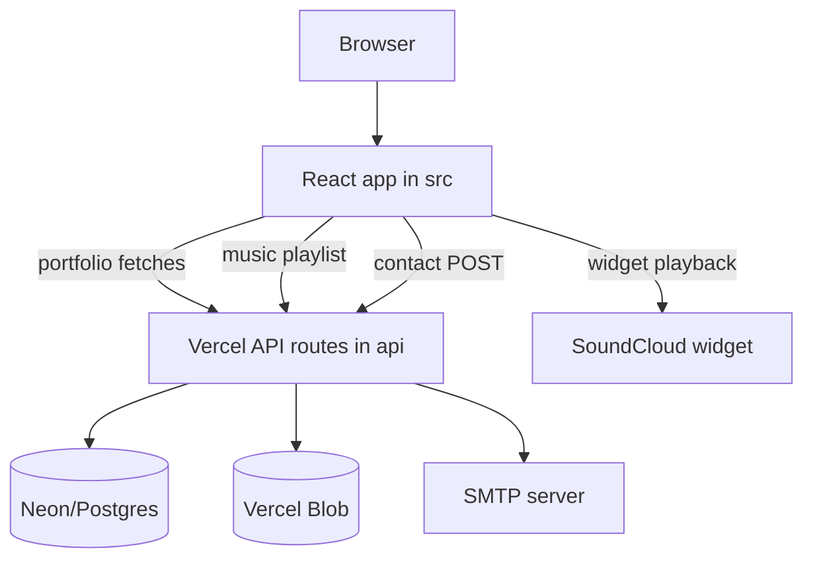

# Architecture

This repository is a frontend-first portfolio site with a small Vercel API surface for content, music, and contact email.

## Frontend Layer

`src/main.jsx` mounts the React app and enables Vercel Analytics/Speed Insights. `src/App.jsx` defines the current route tree and wraps the app with `SiteMusicProvider` and `SiteChromeProvider`.

The public route paths are `/`, `/about`, `/projects`, `/experience`, and `/education`. Skills and contact are no longer standalone routes; `SkillsPage` is rendered by `ExperiencePage`, and `ContactPage` is rendered by `AboutPage` on desktop layouts.

## Server/API Layer

Vercel API handlers under `api/` expose read-only portfolio content, music playlist/streaming, and contact email behavior. The JavaScript handlers use server-only environment variables and should not be imported into client code.

## Data Access

`lib/db.js` creates Neon SQL clients from `DATABASE_URL` or `POSTGRES_URL`. Portfolio endpoints query table-specific rows, call `dedupeRowsByTitle` from `lib/contentDedupe.js`, and map database fields into frontend response shapes.

Music metadata is read through `lib/musicMetadataStore.js`, which supports both the legacy `metadata` table and the newer `music_track_metadata` table.

## State Management

The app uses local React state and two small contexts:

- `SiteMusicContext` exposes playlist/playback state and controls.
- `SiteChromeContext` controls whether the placeholder `das` chrome is hidden during route transitions.

## External Boundaries

- Neon/Postgres stores page content and music metadata.
- Vercel Blob stores private music and art files.
- SoundCloud can replace Blob audio when metadata rows contain SoundCloud URLs.
- SMTP sends contact form submissions.
- Vercel Analytics and Speed Insights run from the browser.

## Security Boundary

No authentication or authorization layer is present. Portfolio and playlist endpoints are public read endpoints. The Blob streaming endpoint restricts requested pathnames to `music/` and `arts/`, but it still depends on `BLOB_READ_WRITE_TOKEN` server-side.

The contact endpoint should be hardened in a future pass so low-level SMTP/configuration errors are not returned to clients.
