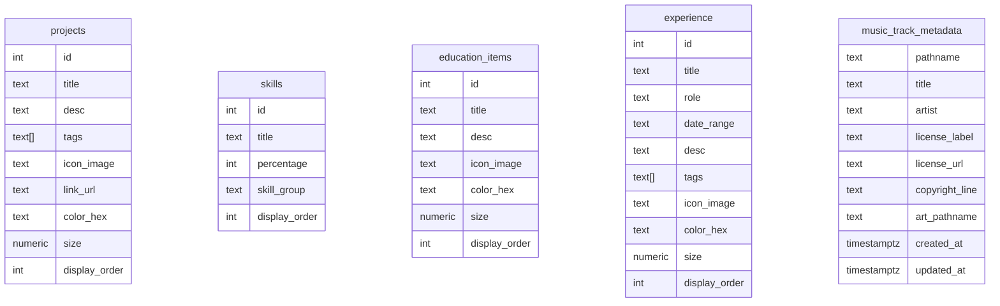

# Data Model

The app does not use an ORM. API routes query Postgres tables directly through Neon SQL clients.

## Page Content

The page-content APIs read `projects`, `skills`, `education_items`, and `experience`. Rows are normalized in the API layer before they reach React pages.

`lib/contentDedupe.js` dedupes rows by normalized title. The mojibake replacements should remain for now in case old seed data appears again.

`size` has legacy behavior in the frontend: values less than or equal to `10` are treated as scale factors, while larger values are treated as pixel sizes.

## Music Metadata

`lib/musicMetadataStore.js` reads from `metadata` first and `music_track_metadata` second. `metadata` is a legacy table name; `music_track_metadata` is the current table name.

The `pathname` field is the primary identity. For Blob music it is a Blob path such as `music/example.mp3`; for SoundCloud it can be the SoundCloud URL.

## Old SQL Script

`api/db/page_content_tables.sql` is an old script and includes destructive cleanup statements. It is tracked for now but should not be treated as an active migration.
